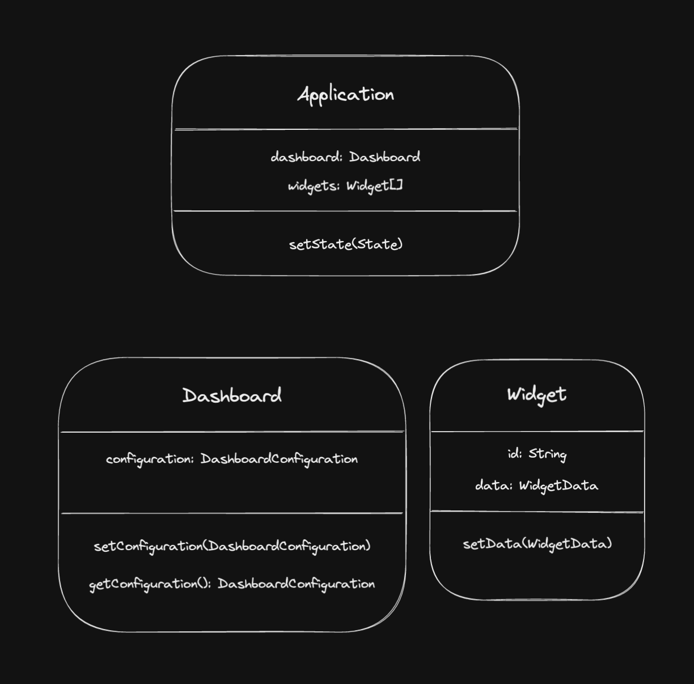
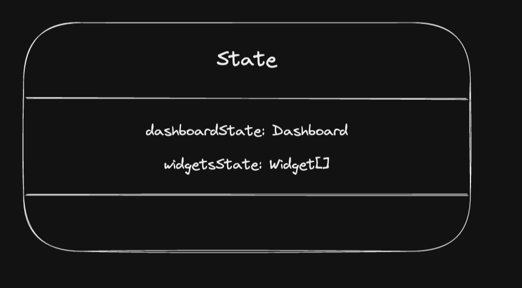
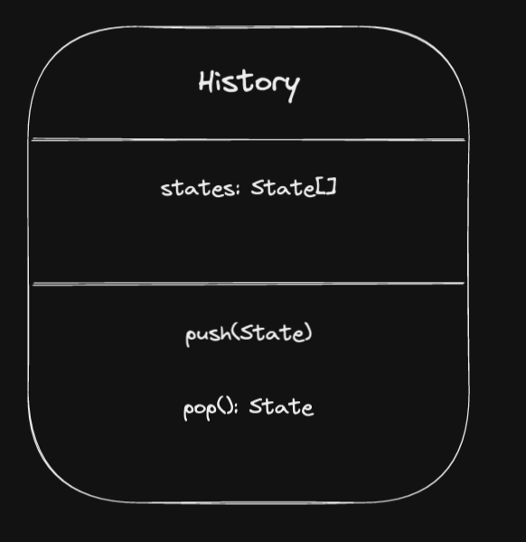
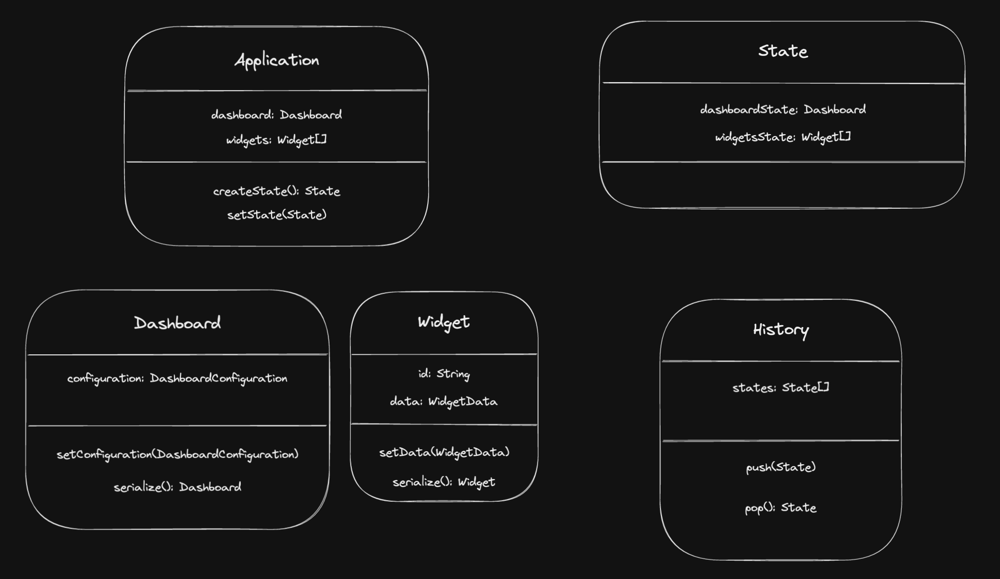

Memento pattern is one of the 23 design pattern from GoF. It's a pattern that can help manage state and take steps to `undo` states.

A very common example is a text editor and undoing content in a text editor. Implementing a memento pattern here would help build out a text editor that can go back in its history.

This is my first time playing with the memento pattern, so take everything here with a grain of salt.

I am going to implement the same pattern but for a situation that I am much more familiar with, Building Dashboards.

## Scenario

A dashboard consists of multiple widgets that can contain some state. Changing a dashboard configuration (Filters, Timelines) can change the data from every widget.
The data is always fetched from a backend service which will give some data to each widget based on the configuration from the dashboard.

What I want to do here is implement an undo button, that will restore the previous dashboard state, so any updates on the dashboard configuration should be stepped back, and also each widget in the dashboard should then render the previous state without making another call to the backend to get the current dataset based on the previous configuration

I also want to implement all this in TypeScript as I am usually building dashboards in Angular, so there might be sprinkes of Angular conventions, however, I am going to keep this as front-end free as possible and only implement the logic for reverting to previous states.

## Requirements

1. Implement an undo functionality reverts Dashboard configuration to previously used Dashboard Configuration
2. All the widgets in the dashboard must revert to their previous state without making any additional calls to the backend.
3. Have a configurable level of history, The consumer can decide how far they want to allow users to step back

I am writing this as I build a solution, so all my thoughts are coming up as we go 🤓

## Solution

### Design

Here is my first draft of what the data looks like on the dashboard and the widget level. This is encapulated in an application which will manage a dashboard and multiple widgets.


Dashboard contains its configuration and methods to set and get the configuration.
Widget contains its data and a method to set the data.

We want to couple the state of the dashboard and the widget together. So when we save or retrieve state, the state is saved together and not individually.

Lets create a state for these 2 classes.


Considering the memento pattern we also need a Caretaker to keep the History of all the states. This will also allow us to keep a list of states to go back more than 1 level.



This is only the initial draft of the design I have in mind. I believe a lot will change as I code this into existence

### Implementing the above design

_Application Design_: The interfaces `DashboardConfiguration` and `WidgetData` are abstractions and not necessary here.

```typescript
class Dashboard {
  constructor(private configuration: DashboardConfiguration) {}

  setConfiguration(configuration: DashboardConfiguration) {
    this.configuration = configuration;
  }
}

class Widget {
  constructor(private readonly id: string, private data: WidgetData) {}

  setData(data: WidgetData) {
    this.data = data;
  }
}

class Application {
  constructor(private dashboard: Dashboard, private widgets: Widget[]) {}
}
```

_State Design_: Very straightforward. Contains Dashboard State and all the widgets in the single dashboard. This is not states of 1 widget but a list of all widget states.

```typescript
class State {
  constructor(
    public dashboardState: Dashboard,
    public widgetsState: Widget[],
  ) {}
}
```

_History Design_: `History` is a reserved word in typescript, so going with `Hist` here. We know that history is going to store a list of states and can implement push and pop functionality.

```typescript
class Hist {
  constructor(private states: State[]) {}

  push(state: State): void {
    this.states.push(state);
  }

  pop(): State {
    this.states.pop();
    return this.states[this.states.length - 1];
  }
}
```

Let's set up some mocks to assume some data has been initialised into our application. We can do all of this in a `main` function to invoke it later.

```typescript
function main() {
  const dashboard = new Dashboard({ name: 'Dashboard One' });
  const widgetOne = new Widget('Widget One', { name: 'Widget One' });
  const widgetTwo = new Widget('Widget Two', { name: 'Widget Two' });
  const widgetThree = new Widget('Widget Three', { name: 'Widget Three' });
  const application = new Application(dashboard, [
    widgetOne,
    widgetTwo,
    widgetThree,
  ]);
}

main();
```

This sets up a skeleton for a working application. Once we are good with our application, we can then create a save point by saving the state of the application in history.

We have to create a method in `Application` that will let us get its current state. We can then create history object and start populating history with the application state at every "save point".

```typescript
class Application {
  constructor(private dashboard: Dashboard, private widgets: Widget[]) {}

  createState(): State {
    return new State(this.dashboard, this.widgets);
  }
}
```

Lets also override the `toString` of application and history to help us see what the state looks like now in the application and also the history.

```typescript
class Application {
  constructor(private dashboard: Dashboard, private widgets: Widget[]) {}

  createState(): State {
    return new State(this.dashboard, this.widgets);
  }

  toString() {
    return { dashboard: this.dashboard, widgets: this.widgets };
  }
}

class Hist {
  constructor(private states: State[]) {}

  push(state: State): void {
    this.states.push(state);
  }

  pop(): State {
    this.states.pop();
    return this.states[this.states.length - 1];
  }

  toString() {
    return this.states;
  }
}
```

And in the main function, we can call `application.toString()` to see the applications state.

```typescript
function main() {
  // Previous details here ...
  const history = new Hist([]);
  history.push(application.createState());

  console.dir({ version: 1, application, history }, { depth: null });
}
```

At this point, lets assume the user changes the dashboard configurations, due to which the dashboards and widgets get updated. Once those changes get updates, we should create another save point in our history.

```typescript
function main() {
  // Previous details here ...

  // Some changes happen here so dashboards and widgets get updated
  dashboard.setConfiguration({ name: 'New Dashboard Configuration' });
  widgetOne.setData({ name: 'New Widget One' });
  widgetTwo.setData({ name: 'New Widget Two' });
  widgetThree.setData({ name: 'New Widget Three' });
  history.push(application.createState());

  // Lets see this new state of our application
  console.dir({ version: 2, application, history }, { depth: null });
}
```

There's a point we missed here. The history shows that even the first version is updated. When we store state in history, we are storing references and not serialized versions, so the history is actually mutable. We can solve this by creating a very naive serialize method in `Dashboard` and `Widget` and use those methods in `Application#createState` that will help avoid this problem.

```typescript
class Dashboard {
  constructor(private configuration: DashboardConfiguration) {}

  setConfiguration(configuration: DashboardConfiguration) {
    this.configuration = configuration;
  }

  // A very naive implementation of serialization
  serialize() {
    return new Dashboard(this.configuration);
  }
}

class Widget {
  constructor(private readonly id: string, private data: WidgetData) {}

  setData(data: WidgetData) {
    this.data = data;
  }

  // A very naive implementation of serialization
  serialize() {
    return new Widget(this.id, this.data);
  }
}

class Application {
  constructor(private dashboard: Dashboard, private widgets: Widget[]) {}

  createState(): State {
    // Store serialized data because state will contain reference to the current classes
    // and will get overwritten with new data
    return new State(
      this.dashboard.serialize(),
      this.widgets.map((widget) => widget.serialize()),
    );
  }

  toString() {
    return { dashboard: this.dashboard, widgets: this.widgets };
  }
}
```

Running the main function now, we can see that previous states are not changing when we update dashboard or widgets.

This is a good place to test our undo logic. Let's assume that this new configuration is not right, and user hits the undo button in the dashboard. We want to revert to the previous configuration and instantly render all the previous widgets.

We will need a `setState` in `Application` to help set the application state

```typescript
class Application {
  constructor(private dashboard: Dashboard, private widgets: Widget[]) {}

  createState(): State {
    // Store serialized data because state will contain reference to the current classes
    // and will get overwritten with new data
    return new State(
      this.dashboard.serialize(),
      this.widgets.map((widget) => widget.serialize()),
    );
  }

  setState(state: State) {
    this.dashboard = state.dashboardState;
    this.widgets = state.widgetsState;
  }

  toString() {
    return { dashboard: this.dashboard, widgets: this.widgets };
  }
}

function main() {
  // Previous details here ...
  application.setState(history.pop());

  // Lets see if our logic has worked to revert back to the inital state
  console.dir({ version: 3, application, history }, { depth: null });
}
```

That worked!

In version 3 of the log, our state has gone back to the initial state and our history only contains the one state that we are on.

We have fulfilled requirements 1 and 2.

Lets finish requirement 3. Allow upto a certain levels of history. This is a very easy change since our `Hist` class can be configured as such

```typescript
class Hist {
  constructor(private states: State[], private maxLength = 10) {}

  push(state: State): void {
    if (this.states.length >= this.maxLength) {
      this.states = this.states.slice(1, this.states.length);
    }
    this.states.push(state);
  }

  pop(): State {
    this.states.pop();
    return this.states[this.states.length - 1];
  }
}
```

This will only keep a running length of 10 items in the history unless configured otherwise.

The final requirement is complete.

Here's the complete code after all the updates

```typescript
class Dashboard {
  constructor(private configuration: DashboardConfiguration) {}

  setConfiguration(configuration: DashboardConfiguration) {
    this.configuration = configuration;
  }

  // A very naive implementation of serialization
  serialize() {
    return new Dashboard(this.configuration);
  }
}

class Widget {
  constructor(private readonly id: string, private data: WidgetData) {}

  setData(data: WidgetData) {
    this.data = data;
  }

  // A very naive implementation of serialization
  serialize() {
    return new Widget(this.id, this.data);
  }
}

class Application {
  constructor(private dashboard: Dashboard, private widgets: Widget[]) {}

  createState(): State {
    // Store serialized data because state will contain reference to the current classes
    // and will get overwritten with new data
    return new State(
      this.dashboard.serialize(),
      this.widgets.map((widget) => widget.serialize()),
    );
  }

  setState(state: State) {
    this.dashboard = state.dashboardState;
    this.widgets = state.widgetsState;
  }

  toString() {
    return { dashboard: this.dashboard, widgets: this.widgets };
  }
}

class State {
  constructor(
    public dashboardState: Dashboard,
    public widgetsState: Widget[],
  ) {}
}

class Hist {
  constructor(private states: State[], private maxLength = 10) {}

  push(state: State): void {
    if (this.states.length >= this.maxLength) {
      this.states = this.states.slice(1, this.states.length);
    }
    this.states.push(state);
  }

  pop(): State {
    this.states.pop();
    return this.states[this.states.length - 1];
  }
}

function main() {
  const dashboard = new Dashboard({ name: 'Dashboard One' });
  const widgetOne = new Widget('Widget One', { name: 'Widget One' });
  const widgetTwo = new Widget('Widget Two', { name: 'Widget Two' });
  const widgetThree = new Widget('Widget Three', { name: 'Widget Three' });
  const application = new Application(dashboard, [
    widgetOne,
    widgetTwo,
    widgetThree,
  ]);

  const history = new Hist([]);
  history.push(application.createState());

  // Lets see the first state of our application
  console.dir({ version: 1, application, history }, { depth: null });

  // Some changes happen here so dashboards and widgets get updated
  dashboard.setConfiguration({ name: 'New Dashboard Configuration' });
  widgetOne.setData({ name: 'New Widget One' });
  widgetTwo.setData({ name: 'New Widget Two' });
  widgetThree.setData({ name: 'New Widget Three' });
  history.push(application.createState());

  // Lets see this new state of our application
  console.dir({ version: 2, application, history }, { depth: null });

  // Lets say above configuration is not correct, so users decides to undo
  // We need to set back to previous state
  application.setState(history.pop());

  // This should match our first state.
  console.dir({ version: 3, application, history }, { depth: null });
}

main();
```

Also, here's the final design of the classes

